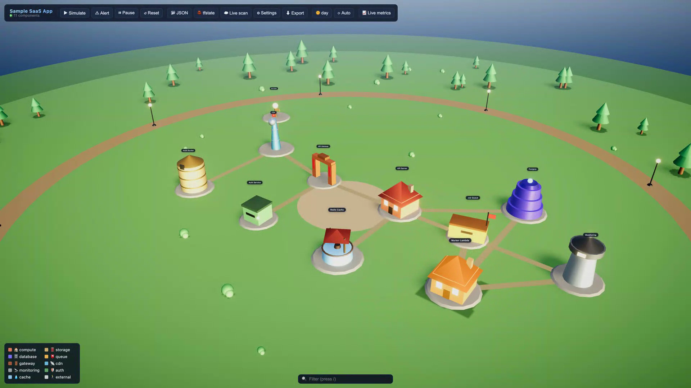

# Cloud Village

> Interactive 3D cloud architecture map. Renders services as buildings in a stylized village. Live-scan AWS / Cloudflare / Azure / GCP / Docker. Watch traffic flow as particles along roads, alerts pulse buildings, day-night cycle, soft shadows, bloom.




> 📽 [Full 1080p MP4](docs/cloud-village-intro.mp4) · [Static poster](docs/cloud-village.png)

---

## Features

- **3D village** — services rendered as houses, vaults, silos, towers, gates. Per-kind PBR materials, soft shadows, bloom, HDRI lighting.
- **2D architecture view** — toggleable SVG diagram for a flat overview. Pan, wheel-zoom (cursor-anchored), fit-to-screen. Buildings → rounded rects colored by kind with health-colored border + kind emoji; connections → curved quadratic paths, protocol-colored, arrowheads, traffic-scaled stroke width.
- **Day / night cycle** — dawn → day → dusk → night with stars, lamp glow, fog, lerped lighting. Manual or auto-advance (12 s per phase).
- **Architecture-driven weather** — sky reflects fleet state: ☀ clear (all healthy) → ☁ cloudy (degraded or traffic spike) → 🌧 rain (≥30% degraded or 3+ alerts) → ⛈ storm (any down / firing critical). 3D rain particles, animated cloud cover, lightning flashes. 2D mode gets canvas rain streaks, drifting cloud blobs, flash overlay. Auto by default; manual override via toolbar.
- **Five sources** — mock demo, JSON upload, Terraform `tfstate`, source-tree generator, or **live cloud scan** via the Go backend.
- **Live metrics** — polls backend every 4 s for CloudWatch alarms + ALB request rates → drives health states, edge particles, deduped alerts.
- **Animated traffic** — request / response / event particles arc along edges. Road color thickens + shifts brown → red as traffic rises, decays over time.
- **Click-to-inspect panel** — incoming / outgoing connections, replayable flows, alert triggers, health override, metadata view.
- **Metrics panel** — toggleable in-app dashboard (📊 Panel). Tabs: summary (counts + health distribution + top kinds), components (sortable by traffic / health / name / kind), edges (top traffic), alerts (severity-coded, click-to-focus). Provider-agnostic — reads live store state so it works for demo, AWS, Azure, GCP, Cloudflare, Docker.
- **Friendlier labels** — building name pills strip scanner prefixes (`ctr_`, `arn:aws:`, …), convert underscores to spaces, truncate to 22 chars with full name in tooltip. Health dot + kind emoji inline. Legend grouped into Buildings / Health / Traffic with hover descriptions; collapsible.
- **Responsive toolbar** — grouped sections on desktop (playback · data · view+atmosphere · telemetry); under 760 px the bar collapses behind a ☰ hamburger and Legend starts minimised, keeping mobile viewports clean.
- **Settings UI** — store provider credentials (AWS keys, Cloudflare token, Azure service principal, GCP service account JSON) in browser `localStorage`. Used as scan-time overrides.

---

## Quick start

```sh
npm install
npm run dev                          # frontend  → http://localhost:5173
cd backend && go run .               # backend   → http://localhost:8787  (optional, needed for ☁ Live scan / 📈 Live metrics)
```

Requirements: **Node 18+**, **Go 1.22+**.

First load shows a mock SaaS village. Try ☁ Live scan, 📂 JSON, or generate from a real project.

---

## Generate village from any project

```sh
npm run generate -- /path/to/project
# writes /path/to/project/village.json

npm run generate -- /path/to/project -o /tmp/out.json
npm run generate -- . --skip k8s,serverless
```

Parsers (run by default):

| Parser | Reads | Produces |
|--------|-------|----------|
| **compose** | `docker-compose.yml` / `compose.yml` | service per `services.*`, edges from `depends_on`, kind from image |
| **pkg** | every `package.json` | compute node, externals inferred from deps (`pg`, `redis`, `mongoose`, `@aws-sdk/*`, `stripe`, `resend`, `openai`, …) |
| **env** | every `.env*` | externals from var names (`DATABASE_URL`, `REDIS_URL`, `STRIPE_*_KEY`, `OPENAI_API_KEY`, …) |
| **serverless** | `serverless.yml` | Lambda fn + DDB/S3/SQS/SNS resources + edges |
| **k8s** | yaml under `k8s/` `kube/` `manifests/` `deploy/` `charts/` `kustomize/` | Deployment / Service / StatefulSet / Job, Service→Deployment edges by `app` label |

Output is auto-laid-out (grid by kind, hubs centered by connection degree). Load via 📂 JSON.

---

## Loading architecture

| Source | Trigger | Description |
|--------|---------|-------------|
| Demo | default on first run | Mock SaaS village |
| Source-gen | `npm run generate -- <path>` | Auto-build from project source (compose, package.json, .env, serverless, k8s) |
| JSON | **📂 JSON** | Upload `VillageConfig` JSON. Schema below. |
| Terraform | **🧱 tfstate** | Upload `terraform.tfstate`. Extracts AWS resources, infers edges from IAM policies + ALB target groups + dependencies. |
| Live cloud | **☁ Live scan** | Calls backend `/api/scan` for AWS / Cloudflare / Docker / Azure / GCP. Creds come from **⚙ Settings** + backend env. |

Last loaded village persists in `localStorage` (`cloud-village:lastVillage`).

### JSON schema

```json
{
  "name": "string",
  "components": [
    {
      "id": "...", "name": "...",
      "kind": "compute|storage|database|queue|gateway|cdn|monitoring|auth|cache|external",
      "provider": "aws|gcp|azure|cloudflare|docker|generic",
      "position": [x, z], "health": "healthy|degraded|down",
      "meta": { "any": "string|number" }
    }
  ],
  "connections": [
    { "id": "...", "from": "id", "to": "id", "protocol": "http|grpc|sql|event|tcp", "label": "optional" }
  ]
}
```

Components with `position: [0, 0]` (or missing) get an auto-layout slot based on `kind` columns and connection degree.

---

## Building map

| Cloud kind | Building |
|------------|----------|
| compute    | house + pitched roof + lit windows |
| storage    | banded silo |
| database   | stacked vault discs + pulse beacon |
| queue      | post office + flag |
| gateway    | arched town gate w/ banners |
| cdn        | radio tower + dish + beacon |
| monitoring | watchtower + searchlight |
| auth       | guardhouse + lantern |
| cache      | well |
| external   | signpost / traveler |

---

## UI controls (toolbar)

The toolbar is split into colour-coded groups. On viewports under 760 px the entire bar collapses behind a **☰ hamburger** that shows only the brand + health badges; tap it to expand the full menu.

**Brand / status (left)** — village name, component count, health chips (green / amber / red), live alert badge.

**Playback** (icon-only buttons with tooltips)

| Icon | Action |
|------|--------|
| ⏸ / ▶ | Pause / resume all animation (also `Space`) |
| ⚡ | Replay flows on every edge |
| ⚠ | Spawn a random alert |
| ↺ | Reload mock village |

**Data** (icon-only on mobile)

| Button | Action |
|--------|--------|
| ⤓ Data ▾ | Dropdown: load JSON, load Terraform `tfstate`, export current village |
| ☁ Live scan | Open scan modal (live cloud scan via backend) |
| ⚙ | Provider credentials modal |

**View + atmosphere**

| Button | Action |
|--------|--------|
| 🏘 3D / 🗺 2D | Segmented switch between 3D village and 2D architecture |
| 🌅 / 🌞 / 🌆 / 🌙 phase | Cycle time-of-day. ⟳ side button toggles auto-cycle (12 s per phase) |
| ☀ / ☁ / 🌧 / ⛈ weather | Cycle weather mode. ⟳ side button re-engages auto-derivation from fleet health |

**Telemetry (right)**

| Button | Action |
|--------|--------|
| 📈 Live | Toggle backend metrics polling (4 s). Pulsing dot indicates active polling |
| 📊 Panel | Toggle in-app metrics dashboard (summary / components / edges / alerts) |

### Keyboard

| Key | Action |
|-----|--------|
| `/` | Focus search bar |
| `Esc` | Deselect / clear search |
| `Space` | Pause / resume animation |

---

## Animations

- **Request / response / event particles** arc along edges (blue / green / yellow).
- **Critical alerts** pulse the building red + slide a toast in (auto-dismiss 6 s, deduped 60 s window).
- **Health states** — green (healthy) / amber (degraded) / red (down) emissive glow.
- **Traffic heatmap** — roads thicken + shift brown → orange → red based on recent flow count, decays exponentially.
- **Day / night** — sun pos / color / intensity, hemisphere + ambient colors, fog, exposure, sky turbidity, bloom threshold, star field, lamp emissive — all lerp between phases. Auto-cycle: 12 s per phase.
- **Postprocessing** — Bloom + HueSaturation + BrightnessContrast + Vignette + ACES filmic tonemap + SMAA.
- **Live metrics mode** — client polls `/api/metrics` every 4 s. Falls back to client-side simulator only if no real scan has run.

---

## Architecture-driven weather

The sky is a glanceable health gauge — operators can read the overall fleet state without opening any panel. Auto-derivation samples store state every 2 s ([src/hooks/useWeatherAuto.ts](src/hooks/useWeatherAuto.ts)).

| Mode | Triggers (first match wins) |
|------|-----------------------------|
| ⛈ Storm | any component `health === 'down'` **OR** any active alert with `severity === 'critical'` |
| 🌧 Rain | ≥30 % components `degraded` **OR** ≥3 active alerts |
| ☁ Cloudy | any component `degraded` **OR** any active alert **OR** sustained edge traffic |
| ☀ Clear | fully healthy and quiet |

3D scene effects ([src/scene/WeatherSystem.tsx](src/scene/WeatherSystem.tsx))

- **Rain** rendered as instanced `lineSegments` (rain 220 drops / storm 420). Position updates throttled to 30 Hz to cap GPU upload.
- **Storm lightning** randomly spikes the directional-light intensity every 3–12 s, decays back over ~300 ms.
- **Fog + sun** lerp to per-mode tint (cloudy → grey, rain → blue-grey, storm → dark navy) and dim (cloudy 0.78×, rain 0.55×, storm 0.35×).
- **Cloud sprites** get heavier opacity + darker tint per mode.

2D-view effects ([src/ui/WeatherOverlay.tsx](src/ui/WeatherOverlay.tsx))

- Canvas rain streaks with slant + slight perspective (rain 50 / storm 110), capped at 30 fps.
- Drifting cloud blobs (cloudy +).
- Full-screen tint per mode + lightning flash overlay synchronised to storm strikes.

Manual override via the toolbar weather chip flips `weatherAuto` off so the sky stays put while investigating; the ⟳ Auto side button re-engages derivation.

---

## Metrics panel

Open with **📊 Panel** on the toolbar. Side panel docked right; auto-shifts left when an inspect panel is open so both fit side-by-side.

| Tab | Shows |
|-----|-------|
| Summary | Component count, connection count, active-edge count, alert count, health distribution bar (healthy / degraded / down), top kinds breakdown |
| Components | All components in a sortable table (traffic / health / name / kind). Click a row → focuses the building and opens InspectPanel |
| Edges | Top 20 connections by current traffic, from → to + protocol + rate |
| Alerts | Recent alerts feed, severity-colored, timestamped. Click → focus the offending component |

Panel reads directly from the live store (`village`, `alerts`, `edgeTraffic`), so it is **provider-agnostic**: works with demo data, JSON uploads, Terraform state, or any of the live scanners (AWS, Azure, GCP, Cloudflare, Docker). When 📈 Live metrics is on, numbers update every 4 s automatically.

`backend/internal/metrics/docker.go` is what feeds the panel for local Docker setups: container `running`/`exited`/`dead` → health, CPU% ≥ 85 → degraded, ≥ 99 → down with critical alert, and network (rx+tx) bytes/sec scaled into edge rates. Same `Snapshot` shape as the AWS adapter, no external service required.

---

## Backend

Go module at `backend/` exposing a small HTTP API.

```
backend/main.go                       # chi router, /health /api/scan /api/metrics
backend/internal/village/types.go     # VillageConfig / Component / Connection
backend/internal/scan/aws.go          # AWS SDK Go v2 (ECS, Lambda, DDB, ALB, S3, ECR, SQS, SNS, SFN, CloudFront, APIGW, CWLogs)
backend/internal/scan/cloudflare.go   # Cloudflare REST API
backend/internal/scan/docker.go       # Local Docker engine via docker SDK
backend/internal/scan/azure.go        # Azure Resource Manager SDK
backend/internal/scan/gcp.go          # GCP Cloud Asset Inventory (REST + google ADC)
backend/internal/metrics/aws.go       # CloudWatch alarms + ALB RequestCountPerTarget
backend/internal/metrics/docker.go    # Local Docker container CPU%, net rx/tx, run state
backend/internal/metrics/handler.go   # /api/metrics provider switch
```

Endpoints:

- `GET  /health` — `{ok: true}`
- `POST /api/scan` — body `{ provider, ... }` → `VillageConfig`
- `GET  /api/metrics?provider=aws` — CloudWatch alarms + ECS health + ALB request rate
- `GET  /api/metrics?provider=docker` — local Docker container CPU%, network rx+tx, run state (no external service)

### Docker live metrics (local, zero external dependencies)

After running a Docker scan, toggle **📈 Live metrics**. Each 4 s poll reads from the local Docker socket and reports:

- **Health** — container `running` → healthy, `exited`/`dead` → down, else degraded. CPU ≥ 85% downgrades to degraded; ≥ 99% to down.
- **Edge rates** — sum of (rx + tx) bytes/sec for the two endpoints of each connection, scaled into a request-rate proxy.
- **Alerts** — high-CPU per container (`warning` ≥ 85%, `critical` ≥ 99%).

All data comes from `/var/run/docker.sock`. No Prometheus, no exporter, no third-party service.

### Credential resolution

| Provider | Precedence (highest first) |
|----------|----------------------------|
| **AWS** | ⚙ Settings static keys → ⚙ Settings profile → scan-body keys/profile → SDK default chain (env vars, `~/.aws/credentials`, SSO, IMDS) |
| **Cloudflare** | ⚙ Settings API token → scan-body token → `CLOUDFLARE_API_TOKEN` env |
| **Docker** | ⚙ Settings socket path → scan-body socket → `/var/run/docker.sock` |
| **Azure** | ⚙ Settings service principal (`tenantId` + `clientId` + `clientSecret`) → `DefaultAzureCredential` (env, `az login`, managed identity) |
| **GCP** | ⚙ Settings service-account JSON → Application Default Credentials (`gcloud auth application-default login`) |

Credentials entered in ⚙ Settings are stored in browser `localStorage` (key `cloud-village-creds`) in plaintext. Use read-only credentials only. For shared machines, prefer shell env vars on the backend.

### AWS IAM read-only perms

```
ecs:List*, ecs:Describe*
lambda:ListFunctions
dynamodb:ListTables, dynamodb:DescribeTable
elasticloadbalancing:Describe*
s3:ListAllMyBuckets
ecr:DescribeRepositories
sqs:ListQueues, sqs:GetQueueAttributes
sns:ListTopics
states:ListStateMachines
cloudfront:ListDistributions
apigateway:GET
logs:DescribeLogGroups
cloudwatch:DescribeAlarms, cloudwatch:GetMetricData
```

### Resource → kind per provider

| Provider | Mapping |
|----------|---------|
| AWS        | ECS / Lambda / SFN → compute, DDB → database, S3 / ECR → storage, SQS / SNS → queue, ALB / APIGW → gateway, CloudFront → cdn, CWLogs → monitoring |
| Cloudflare | Worker / Pages → compute, KV → cache, R2 → storage, D1 → database, Queues → queue, Zones → gateway |
| Docker     | postgres / mysql / mongo → database, redis → cache, rabbitmq / kafka → queue, nginx / traefik → gateway, prometheus / grafana → monitoring, others → compute |
| Azure      | VM / App / AKS / Functions → compute, Storage / ACR → storage, SQL / Postgres / MySQL / Cosmos → database, ServiceBus / EventHub → queue, LB / AppGW / APIM → gateway, CDN → cdn, Insights → monitoring, KeyVault → auth, Redis → cache |
| GCP        | GCE / GKE / CloudRun / Functions → compute, GCS / AR → storage, SQL / Spanner → database, PubSub / Tasks → queue, LB / APIGW → gateway, Memorystore → cache, Secret / IAM → auth |

---

## Tech stack

- **Frontend** — React 18, TypeScript, Vite
- **3D** — three.js via `@react-three/fiber`, `@react-three/drei`, `@react-three/postprocessing`
- **State** — `zustand`
- **Backend** — Go 1.22+, `chi` router, AWS SDK Go v2, Azure SDK, Docker SDK, `golang.org/x/oauth2/google`

---

## Security

- ⚙ Settings stores credentials in browser `localStorage` in plaintext. Anyone with access to the browser, browser extension permissions, or via XSS can read them. **Use read-only credentials only.**
- Never paste production write-capable keys.
- Backend forwards credentials directly to provider SDKs — it does not log or persist them.
- For shared / multi-user setups, prefer backend env vars or SSO-issued temporary credentials over the ⚙ Settings dialog.
- IAM perms in this README are read-only by design. Audit before granting.

---

## Roadmap

- [x] Phase 1 — 3D village render + mock data
- [x] Phase 2 — Click panel, health states
- [x] Phase 3 — Particle flow animation + alerts
- [x] Phase 4 — JSON config loader
- [x] Phase 5 — Terraform `tfstate` parser
- [x] Phase 6 — Live cloud scan backend (Go + chi + AWS SDK Go v2)
- [x] Phase 7 — Cloudflare, Docker, Azure, GCP scanners
- [x] Phase 8 — CloudWatch alarms + ALB request-rate metrics ingest
- [x] Phase 9 — Realistic rendering pass (HDRI, bloom, soft shadows, day/night, props)
- [x] Phase 10 — ⚙ Settings credential vault (per-provider)
- [x] Phase 11 — Docker live metrics (local CPU% / network / state, no external service)
- [x] Phase 11b — In-app Metrics Panel + 2D architecture view + 3D/2D toggle
- [x] Phase 11c — Architecture-driven weather (clear / cloudy / rain / storm), auto-derived from fleet health
- [x] Phase 11d — Toolbar redesign (grouped sections, segmented switch, Data dropdown, mobile hamburger, collapsible Legend)
- [ ] Phase 11e — Azure Monitor / GCP Cloud Monitoring / Cloudflare Analytics metrics adapters
- [ ] Phase 12 — Code-split bundle (lazy-load three.js + postprocessing)
- [ ] Phase 13 — GLTF asset kit support (Quaternius / Kenney)
- [ ] Phase 14 — Multi-account / multi-region AWS scan in one render

---

## Contributing

PRs welcome. Keep parsers / scanners pure functions where possible. New backend providers go under `backend/internal/scan/<name>.go` and register in `main.go`. New frontend kinds go under `src/scene/Building.tsx` `buildingGeo()` switch.

```sh
npm run dev                # frontend
cd backend && go run .     # backend

# type-check / vet before PR
npx tsc --noEmit -p tsconfig.json
cd backend && go vet ./...
```

---

## License

MIT — see [LICENSE](LICENSE).

Built by [Naimuddin Shahjalal Bhuyan](https://naimjeem.me).
